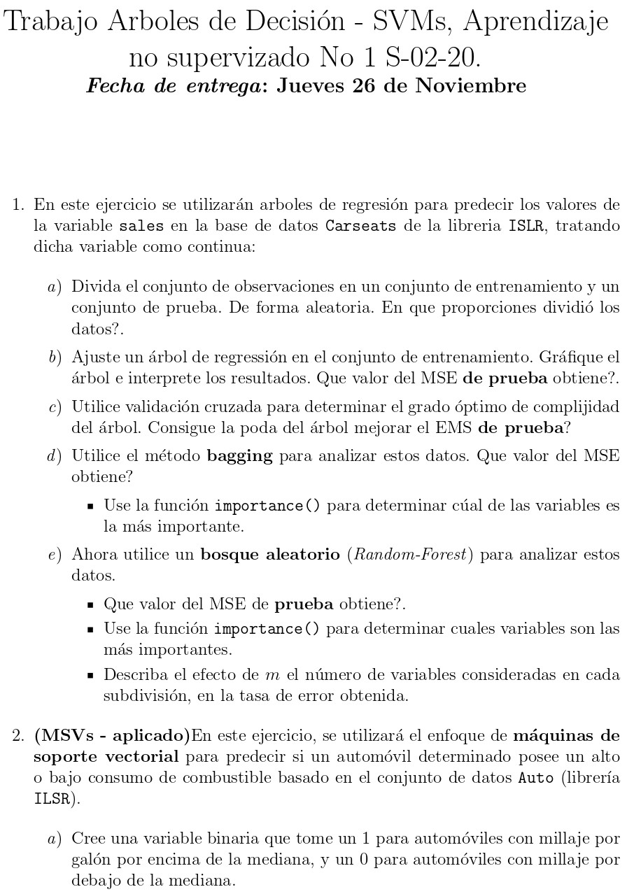
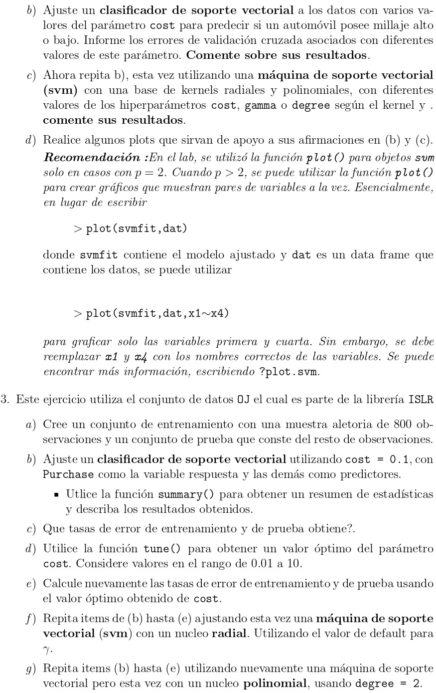
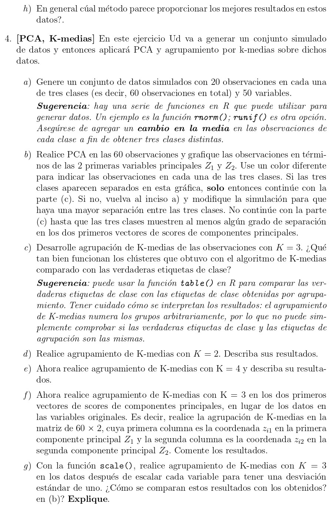
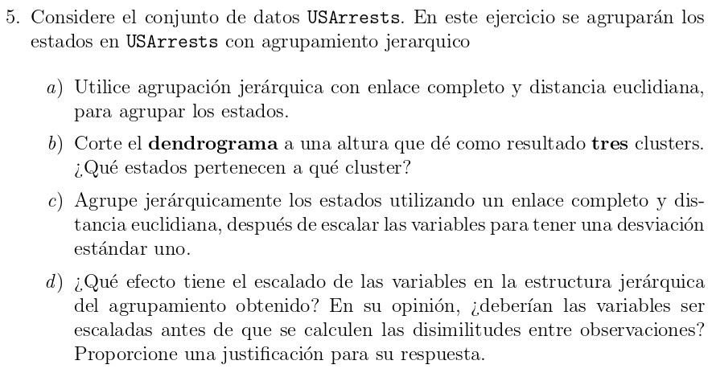

```{r setup, include=FALSE}
knitr::opts_chunk$set(echo = T, message = F, warning = F, error = F, 
                      out.width = '60%', fig.align = 'center', fig.pos= "h")
```

```{r out.width = '80%', fig.align = 'center', fig.pos= "h", echo = F}
require(knitr)

```

```{r out.width = '90%', fig.align = 'center', fig.pos= "h", echo = F}

```

```{r out.width = '90%', fig.align = 'center', fig.pos= "h", echo = F}

```

```{r out.width = '90%', fig.align = 'center', fig.pos= "h", echo = F}

```

# Solución

```{r}
require(ISLR)
datos <- Carseats
```

## 1.a)

Los datos son particionados aleatoriamente en el 70% para entrenamiento (train) y el 30% de prueba (test)

```{r}
set.seed(123)
muestra <- sample(1:nrow(datos), size = floor(nrow(datos) * 0.7))
train <- datos[muestra, ]; test <- datos[-muestra, ]
```

## 1.b)

```{r}
require(tree)
require(MASS)

Reg.tree <- tree(Sales ~ ., data = datos, subset = muestra)
summary(Reg.tree)
plot(Reg.tree)
text(Reg.tree, , pretty = 0)
```


## 1.c)

## 1.d)

## 1.e)

## 2.a)

## 2.b)

## 2.c)

## 2.d)

## 3.a)

## 3.b)

## 3.c)

## 3.d)

## 3.e)

## 3.f)

## 3.g)

## 3.h)

## 4.a)

## 4.b)

## 4.c)

## 4.d)

## 4.e)

## 4.f)

## 4.g)

## 5.a)

## 5.b)

## 5.c)

## 5.d)
